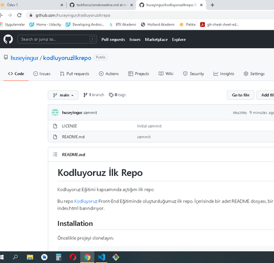

# Kodluyoruz İlk Repo
Kodluyoruz Eğitimi kapsamında açtığım ilk repo

Bu repo [Kodluyoruz](https://www.kodluyoruz.org) Front-End Eğitiminde oluşturduğumuz ilk repo. İçerisinde bir adet README dosyası, bir adet de index.html barındırıyor.



## Installation
Öncelikle projeyi clonelayın.

```
git clone https://github.com/huseyingur/kodluyoruzilkrepo.
```
## Usage
Projeyi Cloneladıktan sonra Visual Studio code programını açınız.
Linux İçin:
```
cd kodluyoruzilkrepo
code .
```

## Contributing
Pull requestler kabul edilir. Büyük değişiklikler için, lütfen önce neyi değiştirmek istediğinizi tartışmak için bir konu açınız.

## License
[MIT](https://choosealicense.com/licenses/mit/)


